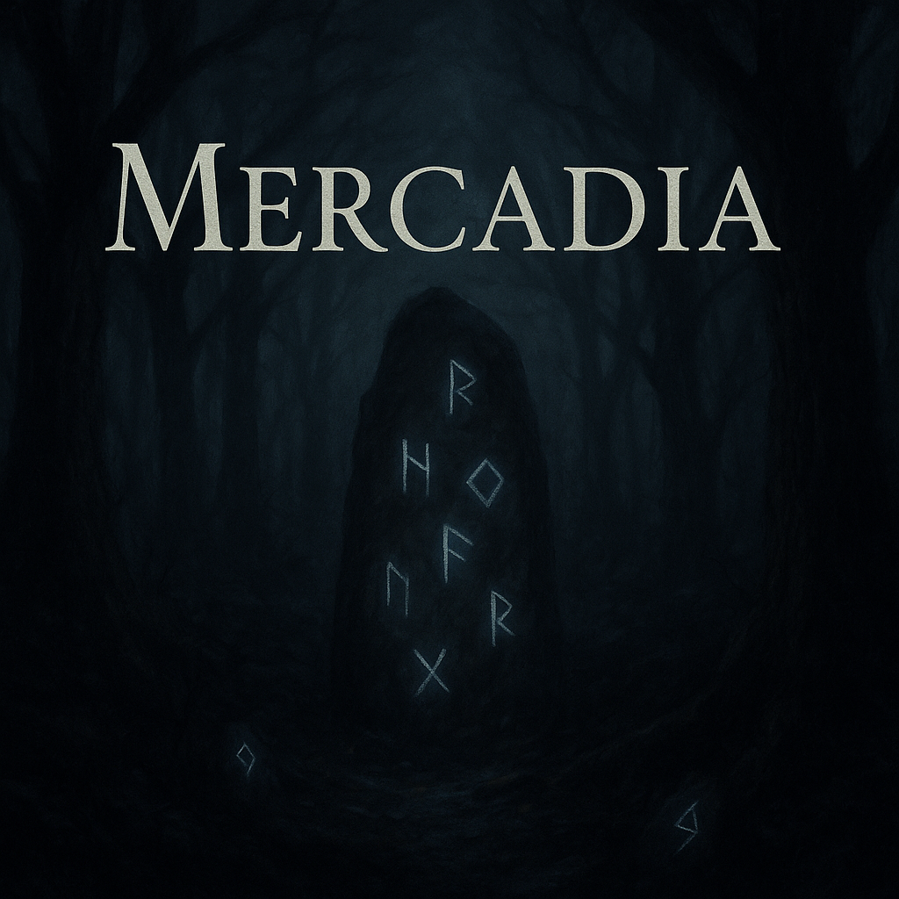

# 🧭 **Mercadia**  
*A Text-Based Adventure Game*

## 📖 Overview

**Mercadia** is an immersive, text-based adventure game where you awaken in a mysterious forest with no memory of how you arrived. Armed only with a flickering compass, a fragmented journal, and a vial of glowing blue liquid, you must navigate branching paths, uncover hidden truths, and face ancient forces that test your choices—and your courage.

## 🕹️ How to Play

- The game begins by asking for your name to personalize your experience.
- You will be prompted with choices that determine your path.
- Each decision shapes the narrative, revealing secrets, dangers, or unexpected consequences.
- Some scenes may loop back to earlier crossroads, while others lead deeper into the unknown.

### Initial Choices

After waking in the forest, you are given three mysterious items and presented with two primary paths:
- **North** into a humming, otherworldly forest.
- **East** toward the ruins of a long-forgotten city.

Each route offers unique discoveries, branching decisions, and encounters that test your resolve and wit.

## ✨ Features

- Atmospheric, typewriter-style narrative printing
- Dramatic decision points that influence the story
- Mysterious environments: overgrown ruins, humming forests, ancient trials
- Replayable structure with alternate paths and outcomes
- No external libraries needed — 100% pure Python

## ▶️ Running the Game

To play the game, run the script using:

```bash
python app.py
```

> Make sure your terminal supports ANSI escape codes (most modern terminals do) for the best experience with bold and italicized text.

## 📜 License

This project is open-source and available under the [MIT License](LICENSE).
